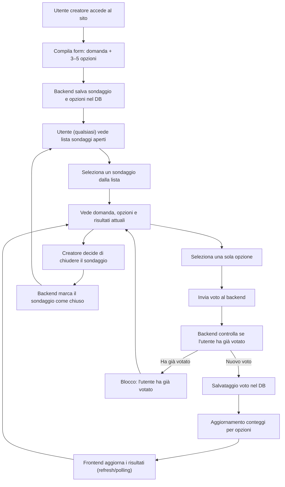
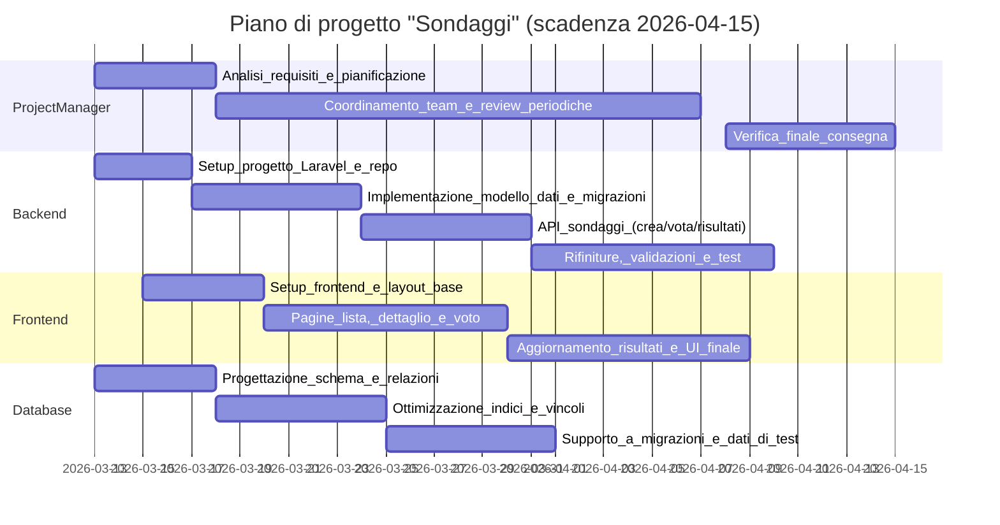

## Documentazione generale del progetto “Sondaggi”

### 1. Obiettivo del sistema
Il progetto **Sondaggi** ha l’obiettivo di realizzare un’applicazione web che permetta:
- **Creazione di sondaggi** da parte di un utente creatore.
- **Voto ai sondaggi** da parte degli altri utenti, con la regola di **un solo voto per utente per ogni sondaggio**.
- **Visualizzazione dei risultati in tempo (quasi) reale**, mostrando il **numero di voti per ciascuna opzione**.
- **Gestione della lista dei sondaggi disponibili**, distinguendo fra **sondaggi aperti** e **sondaggi chiusi**.
- **Chiusura di un sondaggio** da parte del solo **utente che lo ha creato**.

Il sistema è pensato come **esercizio didattico** per lavorare in team, suddividendo chiaramente i ruoli:
- **Project Manager**
- **Sviluppatore Backend**
- **Sviluppatore Frontend**
- **Responsabile Database**

---

### 2. Requisiti funzionali

- **Creare sondaggi**
  - Ogni sondaggio deve avere:
    - una **domanda** testuale;
    - tra **3 e 5 opzioni di risposta**.
  - Il sondaggio appena creato è **attivo/aperto**.

- **Votare un sondaggio**
  - Un utente può selezionare **una sola opzione** per sondaggio.
  - Il sistema deve impedire:
    - un **secondo voto dello stesso utente** sullo stesso sondaggio;
    - voti su sondaggi **chiusi**.

- **Visualizzare i risultati**
  - Per ogni sondaggio occorre mostrare:
    - la domanda;
    - l’elenco delle opzioni;
    - il **conteggio dei voti per opzione**.
  - I risultati devono aggiornarsi automaticamente (ad esempio tramite **refresh periodico** verso il server).

- **Lista dei sondaggi disponibili**
  - Pagina che mostra tutti i sondaggi, con informazioni minime:
    - domanda;
    - stato (aperto/chiuso);
    - numero totale di voti.

- **Chiusura di un sondaggio**
  - Solo il **creatore** del sondaggio può chiuderlo.
  - Dopo la chiusura:
    - nessun nuovo voto è consentito;
    - i risultati rimangono consultabili.

---

### 3. Glossario

- **Utente**: persona che utilizza il sito. Nell’esercizio può essere identificata in modo semplificato (ad esempio tramite sessione o ID fittizio), oppure tramite un vero sistema di autenticazione.
- **Creatore del sondaggio**: utente che ha creato un sondaggio; è l’unico autorizzato a chiuderlo.
- **Sondaggio (Poll/Survey)**: entità che rappresenta una domanda con un insieme di opzioni.
- **Opzione di risposta (Option)**: possibile scelta collegata a un sondaggio (es. “Sì”, “No”, “Non so…”).
- **Voto (Vote)**: scelta di una specifica opzione fatta da un utente per un determinato sondaggio.

---

### 4. Architettura tecnica

L’applicazione è basata su:
- **Backend**: framework **Laravel** (PHP 8.2+), responsabile di:
  - gestione delle rotte HTTP;
  - logica di business (regola “un voto per utente”);
  - accesso e persistenza dei dati nel database;
  - eventuale esposizione di API JSON per il frontend.

- **Frontend**:
  - può essere realizzato con:
    - **Blade + Tailwind CSS**, e/o
    - asset gestiti tramite **Vite** (`npm run dev`, `npm run build`);
  - mostra le pagine per:
    - creare sondaggi;
    - votare;
    - visualizzare lista e risultati.

- **Database**:
  - RDBMS supportato da Laravel (es. SQLite/MySQL, a seconda della configurazione);
  - tabelle principali:
    - `polls`/`surveys` (sondaggi);
    - `options` (opzioni di risposta);
    - `votes` (voti degli utenti).

---

### 5. Modello concettuale dei dati

In forma semplificata:

- **Sondaggio (`polls`)**
  - id
  - question (testo della domanda)
  - creator_id (riferimento all’utente creatore, o identificatore semplificato)
  - is_open (booleano: aperto/chiuso)
  - created_at, updated_at

- **Opzione (`options`)**
  - id
  - poll_id (FK verso `polls`)
  - label (testo dell’opzione)

- **Voto (`votes`)**
  - id
  - poll_id (FK verso `polls`)
  - option_id (FK verso `options`)
  - user_id (identificativo utente)
  - created_at

Vincolo importante:
- **un voto per coppia (`poll_id`, `user_id`)**: garantito da una combinazione di:
  - **vincolo univoco** a livello di database;
  - **controllo applicativo** nel backend.

---

### 6. Flusso utente principale

Di seguito un diagramma in linguaggio **mermaid** che rappresenta il flusso tipico, dalla creazione di un sondaggio alla visualizzazione dei risultati:

---

### 7. Comportamento del client (frontend)

- **Pagina lista sondaggi**
  - Recupera dal server l’elenco dei sondaggi (aperti e, se utile, chiusi).
  - Mostra per ciascuno: domanda, stato e numero complessivo di voti.

- **Pagina dettaglio sondaggio**
  - Mostra la domanda e le opzioni disponibili.
  - Consente all’utente di:
    - selezionare un’opzione;
    - inviare il voto al server.
  - Dopo il voto:
    - blocca un nuovo invio;
    - evidenzia l’opzione scelta;
    - aggiorna i conteggi dei voti.

- **Aggiornamento risultati in “tempo reale”**
  - Implementabile in modo semplice tramite **refresh periodico**:
    - il frontend invia richieste al server ogni N secondi per ottenere i nuovi conteggi;
    - la pagina aggiorna dinamicamente i valori.
  - Come estensione più avanzata (non obbligatoria) si possono usare:
    - **WebSocket**, **Broadcast events** di Laravel o servizi come Pusher.

---

### 8. Requisiti non funzionali principali

- **Semplicità d’uso**
  - Interfaccia chiara, pochi passaggi per creare un sondaggio e per votare.
  - Messaggi di errore comprensibili (es. “Hai già votato questo sondaggio”).

- **Coerenza dei dati**
  - Nessun utente deve riuscire a votare più di una volta lo stesso sondaggio.
  - I conteggi visualizzati devono corrispondere ai dati delle tabelle dei voti.

- **Manutenibilità del codice**
  - Separazione netta tra:
    - logica di business (backend Laravel),
    - presentazione (frontend),
    - persistenza (schema database).
  - Uso corretto di Git e dei branch, come da linee guida del `README.md`.

- **Scalabilità didattica**
  - Il progetto deve essere abbastanza semplice da capire, ma abbastanza strutturato da poter essere esteso:
    - aggiunta autenticazione;
    - supporto a più lingue;
    - filtri sulla lista dei sondaggi;
    - risultati grafici (grafici a barre, ecc.).

---

### 9. Ambiente di sviluppo e comandi principali

Nel contesto Laravel, i comandi tipici sono:

- **Installazione dipendenze PHP**
  - `composer install`

- **Configurazione ambiente**
  - copia del file `.env` da `.env.example` (automatizzato dallo script `setup` in `composer.json`);
  - generazione chiave applicativa:
    - `php artisan key:generate`
  - esecuzione migrazioni:
    - `php artisan migrate`

- **Server di sviluppo**
  - Avvio server Laravel:
    - `php artisan serve`
  - Avvio Vite:
    - `npm install`
    - `npm run dev`

---

### 10. Strategia di collaborazione e Git

Il lavoro di gruppo segue queste regole fondamentali:

- Non lavorare direttamente sui branch `master` o `develop`.
- Ogni funzionalità o ruolo lavora su un **branch dedicato** (es. `nome/feature`).
- Le modifiche vengono integrate in `develop` solo tramite **Pull Request**.
- Il **Project Manager** (Gioele) controlla e approva le PR dopo aver verificato:
  - funzionamento della parte backend;
  - corretto comportamento dell’interfaccia;
  - coerenza del modello dati e delle migrazioni;
  - rispetto dei requisiti dell’esercizio.

Questa documentazione generale è il riferimento comune per tutti i membri del team, mentre ogni studente ha anche un proprio documento di ruolo con istruzioni più specifiche.

---

### 11. Pianificazione temporale e grafico di Gantt

La **scadenza generale del progetto** è fissata al **15/04/2026**.  
Di seguito una proposta di pianificazione per ciascun ruolo, con attività principali e finestre temporali indicative. Le date sono da considerarsi come **obiettivi didattici**: se qualche attività slitta, il team deve coordinarsi con il PM.

#### 11.1 Grafico di Gantt (panoramica progetto)

> Nota: le date sono espresse in formato `YYYY-MM-DD` per compatibilità con il diagramma mermaid.

#### 11.2 Dettaglio per ruolo e scadenze intermedie

- **Project Manager (Gioele)**
  - **Entro 20/03/2026**:
    - Consolidare i requisiti (funzionali e non funzionali) insieme al docente.
    - Verificare che tutti i membri del team abbiano clonato la repo e creato il proprio branch.
  - **Dal 21/03 al 07/04/2026**:
    - Organizzare brevi checkpoint (anche asincroni) per controllare avanzamento backend, frontend e database.
    - Aggiornare eventuali documenti di stato (`docs/stato-gioele.txt`).
  - **Dall’08/04 al 15/04/2026**:
    - Coordinare la fase di integrazione finale e verifica complessiva.
    - Preparare una breve presentazione o riepilogo del progetto.

- **Sviluppatore Backend (Jeorge)**
  - **Entro 20/03/2026**:
    - Completare le **migrazioni principali** (`polls`, `options`, `votes`) e la logica di base “un voto per utente”.
  - **Entro 31/03/2026**:
    - Esporre le **API o rotte** necessarie al frontend per:
      - creare sondaggi;
      - votare;
      - leggere lista sondaggi e risultati.
  - **Dal 01/04 al 10/04/2026**:
    - Rifinire la gestione errori, i messaggi di risposta e gli eventuali controlli di coerenza dati.
    - Collaborare con frontend e DB per correggere problemi di integrazione.

- **Sviluppatore Frontend (Jefferson)**
  - **Entro 22/03/2026**:
    - Definire il **layout principale** del sito (lista sondaggi, pagina dettaglio, form creazione).
    - Collegare il frontend alle API/mock per simulare il flusso principale.
  - **Entro 02/04/2026**:
    - Implementare:
      - pagina lista sondaggi (stato, numero voti);
      - pagina dettaglio con form di voto;
      - visualizzazione risultati base.
  - **Dal 03/04 al 12/04/2026**:
    - Rifinire la UI/UX (messaggi di errore chiari, blocco del secondo voto, feedback visivo).
    - Testare il comportamento con il backend reale.

- **Responsabile Database (Edward)**
  - **Entro 19/03/2026**:
    - Produrre una versione consolidata dello **schema ER** (anche solo documentato) e delle **tabelle** con campi principali.
  - **Entro 27/03/2026**:
    - Definire i **vincoli di integrità** (FK, indici, unique per coppia `poll_id` + `user_id`) e concordare con il backend le migrazioni.
  - **Dal 28/03 al 08/04/2026**:
    - Preparare **dati di test** significativi per permettere a frontend e backend di provare il sistema in modo realistico.
    - Collaborare nella risoluzione di eventuali problemi di performance o incoerenza dati.

Con questa pianificazione, tutti i membri del team hanno **obiettivi intermedi chiari** e una visione d’insieme del percorso che porta alla consegna finale del **15/04/2026**.

